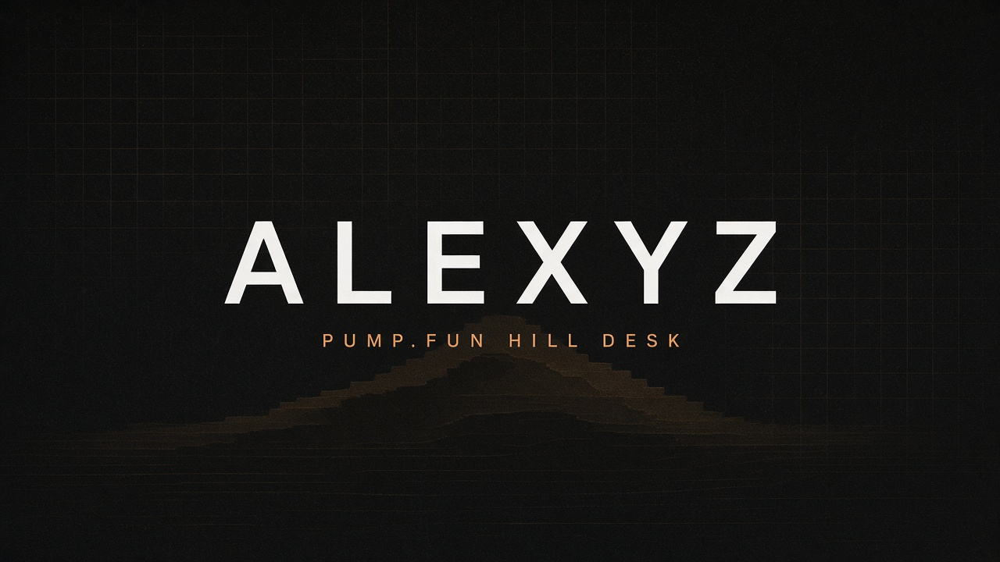

  

<table>
<tr>
<td valign="top" width="62%">

**ALEXYZ** - paper desks for the pump.fun hill.

I do not watch the mint queue. I watch who is sitting on King of the Hill, who is filling the curve under them, and when the chair flips before the timeline does.

Paper-first. No keys in the repo. Nothing sends.

### What I ship

- **[HILLWIRE](https://github.com/alexvxonchain/hillwire)** - SEAT / CLIMB / FALL on the pump.fun hill

### Stack

</td>
<td valign="top" width="38%" align="center">

  

[X / @Alexvx_nft](https://x.com/Alexvx_nft)

[hillwire](https://github.com/alexvxonchain/hillwire)

pump.fun is the board - this desk only reads the hill

</td>
</tr>
</table>
